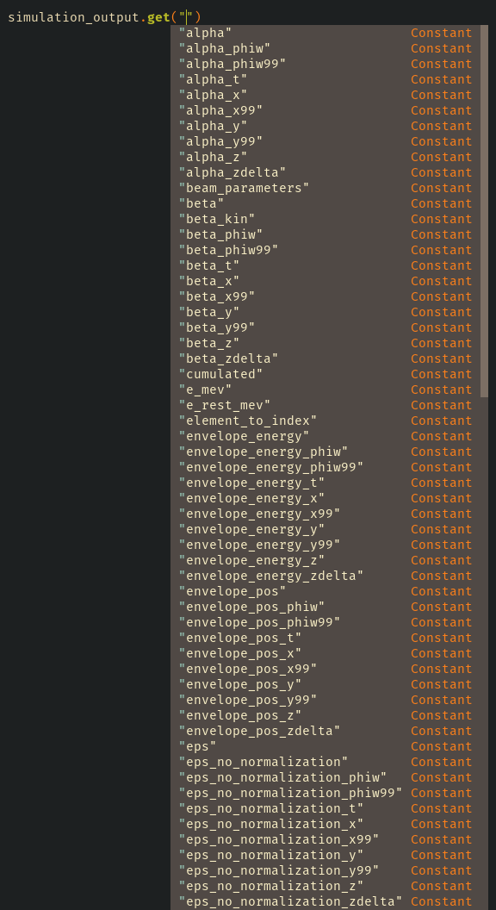

The `get` method
================
Most of the objects defined in LightWin have a *magic* `get` method.
It is a very convenient way to get the data you are interested in without having to type a very cumbersome path.

If the typing completion of your development environment is properly configured, the list of arguments that will work with this method should automatically appear.

Alternatively, you can check the documentation of the `get` methods:

* :meth:`.Accelerator.get`
* :meth:`.BeamParameters.get`
* :meth:`.Element.get`
* :meth:`.FieldMap.get`
* :meth:`.ListOfElements.get`
* :meth:`.ParticleFullTrajectory.get`
* :meth:`.RfField.get`
* :meth:`.SimulationOutput.get`
* :meth:`.TransferMatrix.get`

